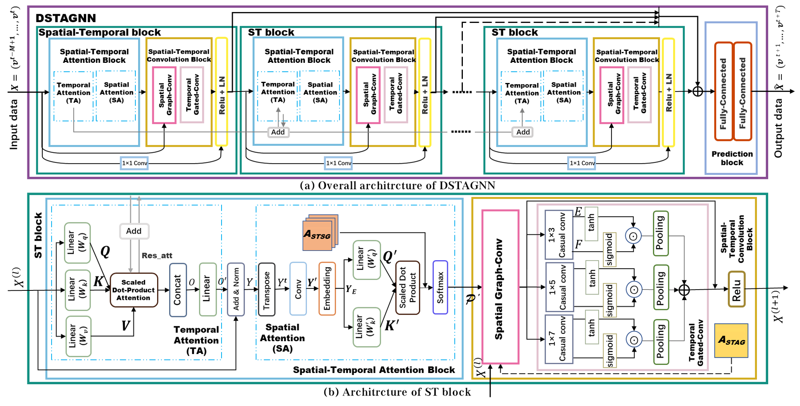

# DSTAGNN

DSTAGNN: Dynamic Spatial-Temporal Aware Graph Neural Network for Traffic Flow Forecasting

DSTAGNN: Dynamic Spatial-Temporal Aware Graph Neural Network for Traffic Flow Forecasting, Proceedings of the 39th International Conference on Machine Learning, PMLR 162:11906-11917. (ICML 2022)

Paper is availabe at https://proceedings.mlr.press/v162/lan22a/lan22a.pdf



# References


# Requirements

+ python >= 3.5
+ scipy
+ tensorboard
+ pytorch

# Datasets

Step 1: DSTAGNN is implemented on those several public traffic datasets.
- **PEMS03**, **PEMS04**, **PEMS07** and **PEMS08** from [STSGCN (AAAI-20)](https://github.com/Davidham3/STSGCN).
Download the data [STSGCN_data.tar.gz](https://pan.baidu.com/s/1ZPIiOM__r1TRlmY4YGlolw) with password: `p72z` and uncompress data file using`tar -zxvf data.tar.gz` 

Step 2: Process dataset

- on PEMS03 dataset

  ```shell
  python prepareData.py --config configurations/PEMS03_dstagnn.conf
  ```

- on PEMS04 dataset

  ```shell
  python prepareData.py --config configurations/PEMS04_dstagnn.conf
  ```
  
- on PEMS07 dataset

  ```shell
  python prepareData.py --config configurations/PEMS07_dstagnn.conf
  ```
  
- on PEMS08 dataset

  ```shell
  python prepareData.py --config configurations/PEMS08_dstagnn.conf
  ```

# Spatial-Temporal Aware Grap Construction
If traffic data is available, its aware grap could also be generated by code:
```
cd ./data/
python STAG_gen.py
```
The shape of input traffic data should be "(Total_Time_Steps, Node_Number). For example, in PEMS08 dataset, it has 170 roads and 62 days data. Thus its shape is (62*288, 170). 

The calculation uses CPU, which should be prepared for enough computation resources.


# Train and Test

- on PEMS03 dataset  
  
  ```shell   
  python train_DSTAGNN.py --config configurations/PEMS03_dstagnn.conf   
  ```

- on PEMS04 dataset  
  
  ```shell   
  python train_DSTAGNN.py --config configurations/PEMS04_dstagnn.conf   
  ```

- on PEMS07 dataset  
  
  ```shell   
  python train_DSTAGNN.py --config configurations/PEMS07_dstagnn.conf   
  ```

- on PEMS08 dataset

  ```shell
  python train_DSTAGNN.py --config configurations/PEMS08_dstagnn.conf
  ```

- visualize training progress:
  ```
  tensorboard --logdir logs --port 6006
  ```
  then open [http://127.0.0.1:6006](http://127.0.0.1:6006) to visualize the training process.


# Configuration

The configuration file config.conf contains two parts: Data, Training:

## Data

+ adj_filename: path of the adjacency matrix file
+ graph_signal_matrix_filename: path of graph signal matrix file
+ stag_filename:path of the Spatial-Temporal Aware Grap file
+ strg_filename:path of the Spatial-Temporal Relevance Graph file
+ num_of_vertices: number of vertices
+ points_per_hour: points per hour, in our dataset is 12
+ num_for_predict: points to predict, in our model is 12

## Training

+ graph: select the graph structure, G or AG, G stands for adjacency graph, AG stands for Spatial-Temporal Aware Grap
+ ctx: set ctx = cpu, or set gpu-0, which means the first gpu device
+ epochs: int, epochs to train
+ learning_rate: float, like 0.0001
+ batch_size: int
+ num_of_weeks: int, how many weeks' data will be used
+ num_of_days: int, how many days' data will be used
+ num_of_hours: int, how many hours' data will be used
+ n_heads: int, number of temporal att heads will be used
+ d_k: int, the dimensions of the Q, K, and V vectors will be used
+ d_model: int, d_E
+ K: int, K-order chebyshev polynomials (number of spatial att heads) will be used
